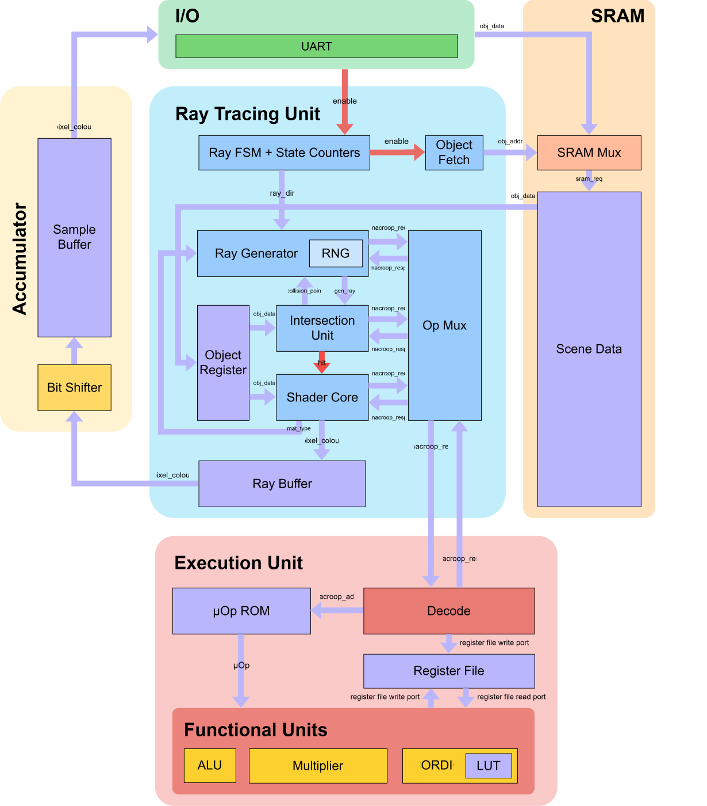

# Introduction

## Introduction to TinyTracer

TinyTracer is a small ray-tracing graphics chip written in Verilog by the
University of Waterloo ASIC Design Team and built through
[Tiny Tapeout](https://tinytapeout.com). A host device (e.g. a laptop) sends a scene description over UART, the chip renders it, and the coloured pixels stream back over the same
UART link. Due to area limitations, TinyTracer renders scenes *serially*, computing one pixel colour at a time.

## Architectural Overview

TinyTracer consists of the following components:

- **I/O**: The I/O Unit communicates between the host device and TinyTracer, which occurs when a new scene is being loaded into memory or pixel data is being streamed back to the host device.
- **SRAM**: The SRAM holds bounding volume data and scene information.
- **Ray Tracing Unit (RTU)**: Each step of the ray tracing algorithm, including ray generation, computing ray-object intersections, and colouring pixels, is executed by the RTU. The RTU sends scalar and vector instructions to the EXU to execute.
- **Execution Unit (EXU)**: TinyTracer's backend handling instruction decode and execution
- **Decode**: The Decode Unit decomposes more complex instructions from the RTU into simple "micro-operations" that the FUs can execute. 
- **Functional Units (FUs)**: Includes ALU, Multiplier, and CORDIC for fixed-point arithmetic.
- **Accumulator**: The Accumulator buffers computed pixel colours from the RTU and averages the results over the number of samples per pixel.

## Rendering a Frame

A 3D scene is first decomposed into individual objects with positional and material metadata. Following this process, each object is sent as a message from the host to the I/O block to decode UART frames into control and data signals for the SRAM. Once the scene is initialized, the host sends a RENDER message to begin rendering the scene with a specified image width and height.

Show memory map figure here (TBD).

The RTU works at sample granularity, computing colours for a pixel one sample at a time. Each module within the RTU sends macro-ops to the EXU, which the Decode Unit then converts into micro-ops to send to the FUs to carry out computations. 

For each pixel, the Ray Generator computes multiple unit vectors directed towards it, where each vector corresponds to "sampling" a pixel's colour. Each unit vector is generated by adding the coordinates of the pixel on the viewport with a random offset generated with the RNG. After ray generation, the RTU fetches bounding volumes from SRAM and stores them in the Object Register, which is used as temporary storage for bounding volume/object metadata. The Intersection Unit reads the bounding volume from the Object Register and determines if a ray intersects it. This process repeats for all the bounding volumes stored in SRAM to find the bounding volume that is closest to the generated ray. Using the result of the ray-bounding-volume intersection, objects within the closest bounding volume are then fetched from SRAM and subsequently checked for intersections with a ray, similar to the process for checking ray-bounding-volume intersection. 

Once the Intersection Unit finds the object with the closest distance to a generated ray, the Shader Core uses the ray-object intersection result, material properties of the intersected object, and scene properties (e.g. sky colour) to compute a colour for the current ray. This colour is stored in the Ray Buffer and a scattered ray is generated using the Ray Generator (if any object was hit). For subsequent ray bounces, their corresponding colours are computed by using the colours from previous ray bounces (see [Shader Core](./modules/rtu/shader_core.md) for more details). When the final ray bounce occurs, the computed colour for a sample is written to the Accumulator. Once each sample for a pixel is processed and their results are added to the Accumulator, the result is averaged over the number of samples computed and the final pixel colour is sent to the I/O Unit. 

