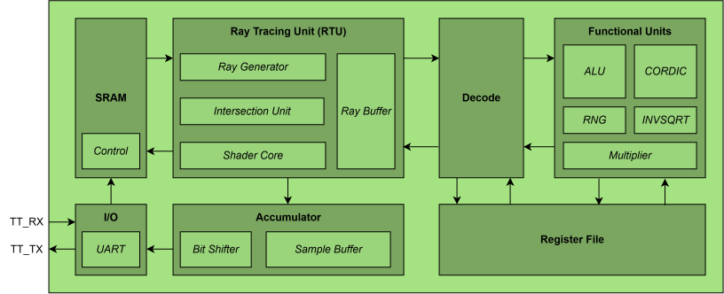

# Introduction

## Introduction to TinyTracer

TinyTracer is a small ray-tracing graphics chip written in Verilog by the
University of Waterloo ASIC Design Team and built through
[Tiny Tapeout](https://tinytapeout.com). A host device (e.g. a laptop) sends a scene description over UART, the chip renders it, and the coloured pixels stream back over the same
UART link. Due to area limitations, TinyTracer renders scenes *serially*, computing one pixel colour at a time.

## Architectural Overview

TinyTracer consists of the following components:

- **Functional Units (FUs)**: Includes ALU, Multiplier, CORDIC, and Random Number Generator (RNG).
- **Ray Tracing Unit (RTU)**: Each step of the ray tracing algorithm, including ray generation, computing ray-object intersections, and colouring pixels, is executed by the RTU. The RTU sends scalar and vector instructions to the FUs to execute.
- **Decode**: The Decode Unit decomposes more complex instructions from the RTU into simple "micro-operations" that the FUs can execute. 
- **Register File**: The Register File is a small set of registers that is used by the FUs to write intermediate results to for more complex multi-step operations like vector dot products.
- **Accumulator**: The Accumulator is a buffer that holds computed pixel colours from the RTU and averages the results over the number of samples per pixel.
- **I/O**: The I/O Unit communicates between the host device and TinyTracer, which occurs when a new scene is being loaded into memory or pixel data is being streamed back to the host device.
- **SRAM**: The SRAM holds bounding volume data, scene information, and LUT values for the CORDIC FU.

## Rendering a Frame

A 3D scene is first decomposed into individual objects with positional and material metadata. Following this process, each object is sent as a message from the host to the I/O block to decode UART frames into control and data signals for the SRAM. After scene initialization, the host sends LUT messages to populate the SRAM LUTs for certain arithmetic algorithms. Once the scene and LUT(s) are initialized, the host sends a RENDER message to begin rendering the scene.

Show memory map figure here (TBD).

The Ray Tracing Unit (RTU) works at sample granularity, computing colours for a pixel one sample/iteration at a time. Each module within the RTU sends request packets to Decode, which then sends micro-ops to the FUs to carry out any necessary computations. 

For each pixel, the **Ray Generator** computes a direction for a given sample. After ray generation, the **Intersection Unit** fetches bounding volumes from **SRAM** and determines which bounding volume a ray intersects with. Using the result of the ray-bounding-volume intersection, objects within the bounding volume of interest are then fetched from **SRAM** and subsequently checked for intersections with a ray. Eventually, the **Shader Core** takes in results of the ray-object intersection (e.g., hit? miss?) and uses material properties of an intersected object to feed back into the **Ray Generator** for scattered ray generation (if an object was hit). When the final ray bounce occurs, the **Shader Core** uses scene properties (e.g. sky colour) to computes the pixel's colour for a given sample. 

## Decode

The **Decode** module decomposes macro-ops into micro-ops. This module additionally organizes computed results to be sent back to the **RTU.**

* Macro-ops carry scalar or vector operations
  * **Decode** decomposes vector operations into scalar operations; maps them to functional units
  * Scalar operations are left unchanged

## Accumulator

Once colour is computed for a given sample, the result is written to the **Accumulator**, which stores computed colours from different samples. The stored colours are then averaged out over the number of samples once the last sample has finished executing (this block keeps track of sample count). The averaged result is then translated into a UART frame to be sent to the host by the **I/O** unit.

