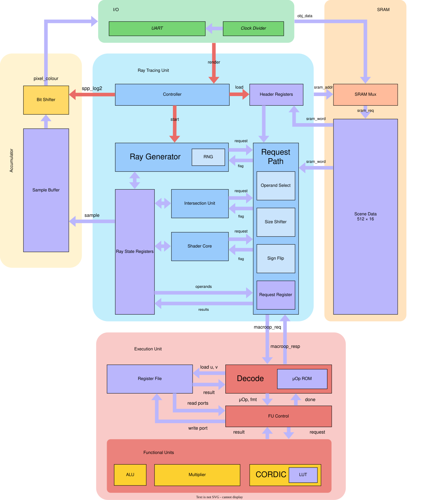

# Introduction

## Introduction to TinyTracer

TinyTracer is a small ray-tracing graphics chip written in SystemVerilog by the
University of Waterloo ASIC Design Team and built through
[Tiny Tapeout](https://tinytapeout.com). A host device (e.g. a laptop) sends a scene description over UART, the chip renders it, and the coloured pixels stream back over the same
UART link. Due to area limitations, TinyTracer renders scenes *serially*, computing one pixel colour at a time.

## Architectural Overview

TinyTracer consists of the following components:

- **I/O**: The I/O Unit communicates between the host device and TinyTracer, which occurs when a new scene is being loaded into memory or pixel data is being streamed back to the host device. It contains the UART and the clock divider that sets the baud rate.
- **SRAM**: The SRAM (512 words of 16 bits) holds the scene: a header with the camera and sky and ground colours, the bounding volumes, and the spheres and triangles. It is written by the I/O Unit before a render and only read by the RTU during a render.
- **Ray Tracing Unit (RTU)**: Each step of the ray tracing algorithm, including ray generation, computing ray-object intersections, and colouring pixels, is executed by the RTU. The RTU does no arithmetic itself: it sends scalar and vector instructions to the EXU to execute. It contains:
    - **Controller**: Runs the pixel, sample, and bounce loops, reads the scene header into the header registers at the start of a render, and starts one sub-block at a time.
    - **Ray Generator**: Makes the camera ray of each sample and the new ray after each bounce. It contains the RNG.
    - **Intersection Unit**: Finds the closest sphere, triangle, or ground hit along a ray, using the bounding volumes to skip objects the ray cannot reach, and computes the hit point and surface normal.
    - **Shader Core**: Tracks the light the ray path carries and makes the sample colour.
    - **Registers and request path**: Header registers, ray state registers shared by the sub-blocks, and the request path that builds each macro-op from them.
- **Execution Unit (EXU)**: TinyTracer's backend handling instruction decode and execution. The EXU receives instructions (macro-ops) from the RTU and returns their results; this is its only connection to the rest of the chip. It contains:
    - **Decode**: The Decode Unit decomposes more complex instructions from the RTU into simple "micro-operations" (read from the µOp ROM) that the FUs can execute.
    - **Register File**: Holds the operands and results of micro-operations.
    - **Functional Units (FUs)**: Includes ALU, Multiplier, and CORDIC for fixed-point arithmetic, started by FU Control.
- **Accumulator**: The Accumulator adds up the sample colours of each pixel from the RTU and averages the results over the number of samples per pixel.

## Rendering a Frame

A 3D scene is first decomposed by the host into spheres and triangles with positional and material metadata, grouped into bounding volumes, and packed into 16-bit words together with a header (see [Scene Encoding](encoding/scene.md)). The host sends each word as an OBJECT message, and the I/O block decodes the UART frames into control and data signals for the SRAM. Once the scene is initialized, the host sends a RENDER message to begin rendering the scene with a specified image width and height.

| Address | Contents |
|----|----|
| 0-16 | Header: camera vectors, sky and ground colours, number of bounding volumes, samples per pixel, camera height |
| 17 onwards | Bounding volumes, 5 words each, up to 16 |
| After the last bounding volume | Spheres (7 words) and triangles (12 words), stored bounding volume by bounding volume |

When the RENDER message arrives, the RTU reads the 17 header words into its header registers. The RTU then renders the image one pixel at a time, row by row, and works at sample granularity, computing colours for a pixel one sample at a time. Each module within the RTU sends macro-ops to the EXU, which the Decode Unit then converts into micro-ops to send to the FUs to carry out computations. Positions and distances are POS (Q9.7) numbers and directions are DIR (Q2.14) numbers (see [Number Formats](encoding/number_format.md)).

For each sample, the Ray Generator computes a unit vector from the camera through the pixel, at a point inside the pixel moved by a random offset generated with the RNG. The ray then traces a path of up to 9 segments: the camera ray and up to 8 bounces. For each segment, the Intersection Unit tests the ray against every bounding volume in SRAM. A bounding volume is a sphere around a few nearby objects: if the ray cannot reach it, the Intersection Unit skips all of its objects. The objects of every bounding volume the ray can reach are fetched from SRAM and checked for intersections with the ray, and the closest hit is kept. If no object was hit and the ray points down, the Intersection Unit tests the ground plane at z = 0. For the closest hit only, it then computes the hit point and surface normal.

If the segment hits nothing, the Shader Core colours the sample with the sky colour. If it hits a glowing object, the Shader Core colours the sample with the object's colour and glow strength. If it hits any other surface, the Shader Core multiplies the attenuation (the light the path still carries) by the surface colour, and the Ray Generator makes the next ray from the hit point in a direction set by the material: random for matte surfaces and the ground, a reflection for mirrors, and a reflection or refraction for glass (see [Shader Core](./modules/rtu/shader_core.md) and [Ray Generator](./modules/rtu/ray_gen/ray_generator.md) for more details). A path that is still bouncing after 8 bounces gives a black sample. The sample colour is written to the Accumulator. Once each sample for a pixel is processed and their results are added to the Accumulator, the result is averaged over the number of samples computed and the final pixel colour is sent to the I/O Unit, which sends it to the host while the RTU renders the next pixel.

## Performance

The software model `sim/tinytracer_sim.cpp` renders a scene with the same 16-bit arithmetic as the chip and counts every macro-op and SRAM read. On the demo scene (`sim/scene_demo.txt`, 512 $\times$ 512), a sample takes 1.81 segments on average and a segment 658 cycles, assuming a 25 MHz clock, 1-cycle ALU and multiplier latencies, and no Controller cycles between macro-ops.

| Samples per pixel | Render time | With the UART at 115,200 baud | With the UART at 230,400 baud |
|:----:|:----:|:----:|:----:|
| 8 | 99.9 s (1.7 min) | 121.0 s (2.0 min) | 102.8 s (1.7 min) |
| 32 | 399.6 s (6.7 min) | 399.6 s (6.7 min) | 399.6 s (6.7 min) |

At 8 samples per pixel, many sky and ground pixels render faster than the 347 µs it takes to send a pixel at 115,200 baud, so the UART slows the render. At 32 samples per pixel, it never does. The 16-bit image differs from a double-precision render of the same scene by a PSNR of 30.4 dB, about as much as two double-precision renders with different random numbers differ (30.6 dB).
