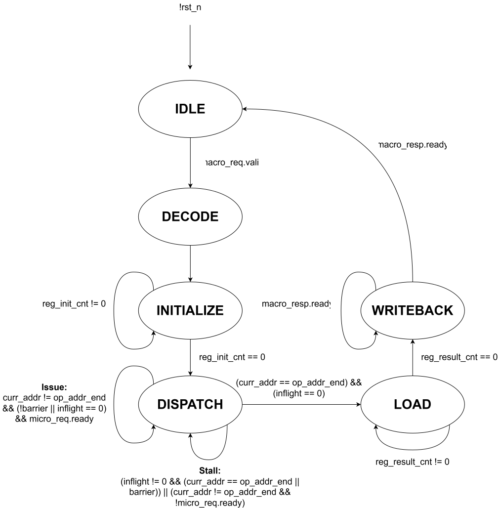

# `decode` — Decodes messages between the RTU and FUs

## Overview

This module decomposes complex macro-ops from the RTU into simple micro-ops that the FUs can compute. The Decode Unit also composes micro-op results from the FUs into macro-op results to send back to the RTU.

## Parameters

| Name          |   Default    | Description                           |
|---------------|:------------:|---------------------------------------|
| `WLEN`  |     16      | Word length              |
| `MICRO_W`  |     13    | Micro operation width             |
| `MACRO_W`  |     101    | Macro operation width             |
| `MACROOP_W`  |     5      | Macro opcode width |
| `MICROOP_W`  |     4      | Micro opcode width |

## Ports

### Inputs

| Name          |   Width    | Description                           |
|---------------|:------------:|---------------------------------------|
| `clk`  |     1      | Clock signal |
| `rst_n`  |     1      | Active-low reset |
| `rf_rdata`  |     `WLEN`      | Register file read port 1 data |
| `macro`  |     [`macro_if.server`](../tinytracer_if.md#macro_if)      | Macro-op request and response channel from the RTU |

### Outputs

| Name          |   Width    | Description                           |
|---------------|:------------:|---------------------------------------|
| `rf_wen`  |     1      | Register file write enable |
| `rf_waddr`  |     3      | Register file write address |
| `rf_wdata`  |     `WLEN`      | Register file write data |
| `rf_raddr`  |     3      | Register file read port 1 address |
| `micro`  |     [`micro_if.client`](../tinytracer_if.md#micro_if)      | Micro-op request and response channel to FU Control |

## Architecture Overview

This overview will refer to the encodings for macro and micro instructions defined in [Instruction Encoding](../../encoding/instruction.md). The Decode Unit behaves according to the following finite-state machine (FSM):

### FSM States
- `IDLE`: Waiting for valid macro-op
- `DECODE`: Decoding macro-op fields
- `INITIALIZE`: Initializing register file based on macro-op
- `DISPATCH`: Issuing micro-ops based on macro-op
- `LOAD`: Reading register file to construct macro-op result
- `WRITEBACK`: Waiting for RTU to accept macro-op result

When a valid macro-op is detected, the FSM transitions to the `DECODE` state. In this state, the macro-op fields are recorded in the `macro_op` register. The following `INITIALIZE` state sets the `reg_init_cnt` counter to the number of registers that need to be initialized for a macro-op. The register file is written beginning from register R0, and `reg_init_cnt` is set using the `MACROOP` field as follows:

| `MACROOP`  |   `reg_init_cnt` |
|:----:|:-------:|
| `M_SQRT`, `M_COS`, `M_RECP`  | 1 | 
| `M_ADD`, `M_SUB`, `M_EQ`, `M_NE`, `M_LT`, `M_GE`, `M_MUL`, `M_DIV`, `M_MAG`  | 2 | 
| `M_NORM`  | 3 | 
| `M_SCAL_VEC`, `M_SPHERE_NORM`  | 4 | 
| `M_VADD`, `M_VSUB`, `M_DOT`, `M_CROSS`  | 6 | 

Alternatively, you can think of `reg_init_cnt` as the number of scalar operands used by a macro-op. For example, scalar-vector multiplication (`M_SCAL_VEC`) uses one scalar operand as the multiplier and three scalar operands as vector elements to multiply by, resulting in a `reg_init_cnt` of 4. Every cycle `reg_init_cnt` is decremented. As long as there are operands remaining that need to be written to the register file (`reg_init_cnt` != 0), the FSM remains in the `INITIALIZE` state. Once all the macro-op operands are written to the register file (`reg_init_cnt` == 0), the FSM transitions to the `DISPATCH` state.

In `DISPATCH`, the Decode Unit uses the `MACROOP` field to select the sequence of micro-ops that execute the desired macro-op. For scalar operations, the selected micro-op is the same as the macro-op, setting `MICROOP` to `MACROOP[3:0]`. For vector operations, the macro to micro-op decompositions defined in [Instruction Encoding](../../encoding/instruction.md) are stored in a small read-only-memory (ROM), where each row holds a `MICRO_W`-bit micro-op and a `barrier` bit for pipeline hazards. The Decode Unit uses the `MACROOP` field to select an address `op_addr` to begin reading micro-ops from, along with an address `op_addr_end` to read up to (exclusive). `op_addr_end` - `op_addr` equals the number of micro-ops required to execute a macro-op. Note that scalar macro-ops also have an entry in the ROM to enable the same FSM transition logic to be used for both scalar and vector macro-ops. The following table shows how `MACROOP` is mapped to ROM addresses:

| `MACROOP`  |   `op_addr` | `op_addr_end` 
|:----:|:-------:|:-------:|
| `M_VADD`  | 0 | 3 |
| `M_VSUB`  | 3 |  6 |
| `M_SCAL_VEC`  | 6 | 9 |
| `M_DOT`  | 9 | 14 |
| `M_CROSS`  | 14 | 23 |
| `M_NORM`  | 23 | 29 |
| `M_SPHERE_NORM`  | 29 | 32 |
| Scalar  | 32 | 33 |

 For example, a vector add macro-op (`M_VADD`) would read micro-ops beginning from address 0 up to address 3, which corresponds to the following micro-ops:

 1. ADD R0 $\leftarrow$ R0, R3
 2. ADD R1 $\leftarrow$ R1, R4
 3. ADD R2 $\leftarrow$ R2, R5. 
 
 The bits stored in rows 0-2 of the ROM would be `14'b00000000110000`, `14'b00010011000000`, and `14'b00100101010000`. Once `op_addr` is determined and a micro-op from ROM is read, `curr_addr` is set to `op_addr` and a micro-op request is sent to the `fu_control` module. The Decode Unit allows for pipelined execution of micro-ops, keeping track of in-flight micro-ops with a 4 bit `inflight` counter that increments for every issued micro-op and decrements each time the `done` signal is asserted back from the `fu_control` module. `inflight` is unchanged if a micro-op issues at the same time another micro-op completes. 
 
 To prevent read-after-write (RAW) and write-after-write (WAW) hazards, certain micro-ops in the ROM have their `barrier` bit set to indicate that all prior micro-ops must complete before the current micro-op can execute. This is similar to a fence instruction which enforces load/store instruction order in multiprocessors, but for arithmetic instructions instead. ROM entries 12, 13, 20, and 24-26 have their `barrier` bits set. For example, the first and second ADD instructions (entries 12 and 13) in a vector dot-product operation (`M_DOT`) have their `barrier` bits marked, since the first ADD depends on the previous three MULs and the second ADD depends on the first ADD. 
 
 There are two possible actions the Decode Unit can take while in the `DISPATCH` state. The first possible action is issuing micro-ops, which occur when there are remaining micro-ops to execute (`curr_addr` != `op_addr_end`), a micro-op's `barrier` bit is clear or the pipeline is empty, and the `fu_control` module can accept a micro-op request. Issuing micro-ops results in `curr_addr` being incremented.
 
 The second possible action is stalling, which occurs when the pipeline is nonempty and there are either no remaining micro-ops to execute or a micro-op's `barrier` bit is set. Stalling also occurs when the `fu_control` module is unable to accept a micro-op request. 

 Once a macro-op is complete (`curr_addr` == `op_addr_end` and `inflight` == 0), the FSM transitions to the `LOAD` state. In the `LOAD` state, the Decode Unit reads macro-op results from the register file. The number of results to read from the register file is `reg_result_cnt`, which is analogous to `reg_init_cnt` for the `INITIALIZE` state. `reg_result_cnt` is set to 1 for scalar results and 3 for vector results. The register file is read beginning from register R0, and `reg_result_cnt` decrements every cycle. Once every result is recorded into the `macro_op_result` register (`reg_result_cnt` == 0), the FSM transitions to the `WRITEBACK` state.
 
 During the `WRITEBACK` state, the FSM checks if the RTU can accept a macro-op result (in general it should always be able to). If the RTU is ready, the Decode Unit sends the macro-op result over the macro-op response channel and transitions back to the `IDLE` state.

### Timing Behaviour

It takes 2 cycles to transition from `IDLE` to `DECODE` to `INITIALIZE`. The number of cycles spent in the `INITIALIZE` state ranges from 1-6 cycles, since the macro-op operand count ranges from 1-6. Next, the time spent in the `DISPATCH` state ranges from 3-77 cycles (for `M_ADD` and `M_NORM` operations, assuming 16 cycle latency for the multiplier and CORDIC). The time spent in the following `LOAD` state ranges from 2-4 cycles, since the number of scalar results range from 1-3. Finally, `WRITEBACK` takes 1 cycle. Hence, the latency of executing a macro-op ranges from 9-90 cycles.