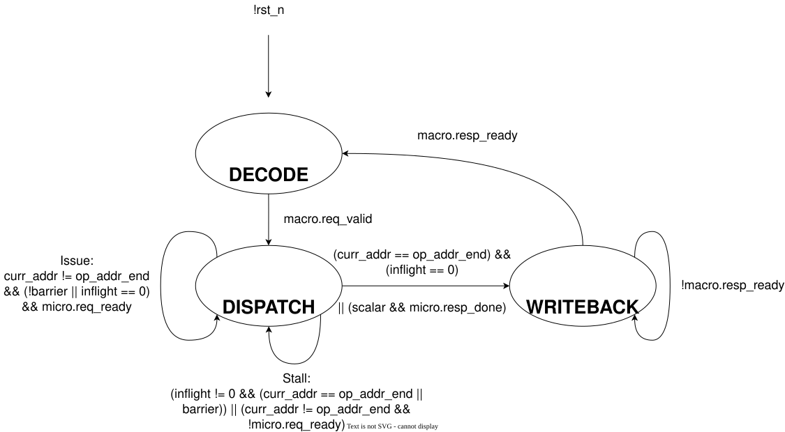

# `decode` — Decodes messages between the RTU and FUs

## Overview

This module sits inside the [Execution Unit](exu.md) and decomposes complex macro-ops from the RTU into simple micro-ops that the FUs can compute. The Decode Unit also composes micro-op results from the FUs into macro-op results to send back to the RTU.

## Parameters

| Name          |   Default    | Description                           |
|---------------|:------------:|---------------------------------------|
| `WLEN`  |     16      | Word length              |
| `MICRO_W`  |     13    | Micro operation width             |
| `MACRO_W`  |     102    | Macro operation width             |
| `MACROOP_W`  |     5      | Macro opcode width |
| `MICROOP_W`  |     4      | Micro opcode width |

## Ports

### Inputs

| Name          |   Width    | Description                           |
|---------------|:------------:|---------------------------------------|
| `clk`  |     1      | Clock signal |
| `rst_n`  |     1      | Active-low reset |
| `rf_result`  |     `vec3_t`      | Register file R0-R2, sent to the RTU as the macro-op result |

### Outputs

| Name          |   Width    | Description                           |
|---------------|:------------:|---------------------------------------|
| `rf_load`  |     1      | Loads the macro-op operands into the register file; high in the cycle a macro-op is accepted |

### Interfaces

| Type          | Description                           |
|---------------|---------------------------------------|
| [`macro_if.server`](../tinytracer_if.md#macro_if)  | Macro-op request and response channel from the RTU, passed through by the EXU |
| [`micro_if.client`](../tinytracer_if.md#micro_if)  | Micro-op request and response channel to FU Control |

## Architecture Overview

This overview will refer to the encodings for macro and micro instructions defined in [Instruction Encoding](../../encoding/instruction.md). The Decode Unit behaves according to the following finite-state machine (FSM):

### FSM States
- `DECODE`: Waiting for a valid macro-op. In the cycle one is accepted, loads the register file, records the macro-op fields, and either reads the first ROM row (vector macro-ops) or issues the micro-op (scalar macro-ops). The FSM resets to this state
- `DISPATCH`: Issuing micro-ops based on macro-op, and waiting for them to complete
- `WRITEBACK`: Waiting for RTU to accept macro-op result

`macro.req_ready` is high in the `DECODE` state. When a valid macro-op is accepted (`macro.req_valid` and `macro.req_ready` both high), the Decode Unit does the following in that same cycle and then transitions to `DISPATCH`:

- Asserts `rf_load`, which loads all of the macro-op operands into the register file in parallel: $u_1$, $u_2$, $u_3$ into R0-R2 and $v_1$, $v_2$, $v_3$ into R3-R5. The layout is the same for every macro-op, and the micro-op sequences in [Instruction Encoding](../../encoding/instruction.md) are written against it
- Records the `MACROOP` and `FMT` fields in the `macro_op` register. The operands live in the register file, so they are not stored a second time
- For a vector macro-op (`M_VADD` to `M_VMUL`), selects the ROM addresses `op_addr` and `op_addr_end` and reads the micro-op at `op_addr`, so that `DISPATCH` can issue it in the next cycle
- For a scalar macro-op (`M_ADD` to `M_MAG`), issues its single micro-op to FU Control straight away. The micro opcode is `MACROOP[3:0]`, the result goes to R0, and the operands are $u_1$ and $v_1$ taken straight from the request (`micro.req_direct` = 1), since the register file is not loaded until the end of the cycle. No micro-op is in flight when a macro-op is accepted, so FU Control can always take it

In `DISPATCH`, the Decode Unit issues the micro-ops that execute the macro-op. The macro to micro-op decompositions of the vector macro-ops defined in [Instruction Encoding](../../encoding/instruction.md) are stored in a small read-only-memory (ROM), where each row holds a `MICRO_W`-bit micro-op and a `barrier` bit for pipeline hazards. The Decode Unit uses the `MACROOP` field to select an address `op_addr` to begin reading micro-ops from, along with an address `op_addr_end` to read up to (exclusive). `op_addr_end` - `op_addr` equals the number of micro-ops required to execute a macro-op. Scalar macro-ops have no ROM rows: their one micro-op is issued in `DECODE`. The following table shows how `MACROOP` is mapped to ROM addresses:

| `MACROOP`  |   `op_addr` | `op_addr_end` 
|:----:|:-------:|:-------:|
| `M_VADD`  | 0 | 3 |
| `M_VSUB`  | 3 |  6 |
| `M_SCAL_VEC`  | 6 | 9 |
| `M_DOT`  | 9 | 14 |
| `M_CROSS`  | 14 | 23 |
| `M_NORM`  | 23 | 29 |
| `M_SPHERE_NORM`  | 29 | 32 |
| `M_VMUL`  | 32 | 35 |

 For example, a vector add macro-op (`M_VADD`) would read micro-ops beginning from address 0 up to address 3, which corresponds to the following micro-ops:

 1. ADD R0 $\leftarrow$ R0, R3
 2. ADD R1 $\leftarrow$ R1, R4
 3. ADD R2 $\leftarrow$ R2, R5. 
 
 The bits stored in rows 0-2 of the ROM would be `14'b00000000110000`, `14'b00010011000000`, and `14'b00100101010000`. Once `op_addr` is determined and a micro-op from ROM is read, `curr_addr` is set to `op_addr` and a micro-op request is sent to the `fu_control` module, together with the recorded `FMT` bit (`micro.req_fmt`). The Decode Unit allows for pipelined execution of micro-ops, keeping track of in-flight micro-ops with a 4 bit `inflight` counter that increments for every issued micro-op and decrements each time `micro.resp_done` is asserted back from the `fu_control` module. `inflight` is unchanged if a micro-op issues at the same time another micro-op completes. 
 
 To prevent read-after-write (RAW) and write-after-write (WAW) hazards, certain micro-ops in the ROM have their `barrier` bit set to indicate that all prior micro-ops must complete before the current micro-op can execute. This is similar to a fence instruction which enforces load/store instruction order in multiprocessors, but for arithmetic instructions instead. ROM entries 12, 13, 20, and 24-26 have their `barrier` bits set. For example, the first and second ADD instructions (entries 12 and 13) in a vector dot-product operation (`M_DOT`) have their `barrier` bits marked, since the first ADD depends on the previous three MULs and the second ADD depends on the first ADD. 
 
 There are two possible actions the Decode Unit can take while in the `DISPATCH` state. The first possible action is issuing micro-ops, which occur when there are remaining micro-ops to execute (`curr_addr` != `op_addr_end`), a micro-op's `barrier` bit is clear or the pipeline is empty, and the `fu_control` module can accept a micro-op request. Issuing micro-ops results in `curr_addr` being incremented.
 
 The second possible action is stalling, which occurs when the pipeline is nonempty and there are either no remaining micro-ops to execute or a micro-op's `barrier` bit is set. Stalling also occurs when the `fu_control` module is unable to accept a micro-op request. FU Control cannot accept a CORDIC micro-op until the CORDIC unit has finished the previous one; the ALU and multiplier accept a new micro-op every cycle.

 A vector macro-op is complete when `curr_addr` == `op_addr_end` and `inflight` == 0, and the FSM then transitions to the `WRITEBACK` state. A scalar macro-op has exactly one micro-op, so the FSM transitions to `WRITEBACK` in the cycle its `done` arrives, without waiting a cycle for `inflight` to read 0. The macro-op result needs no separate read step: the register file drives R0-R2 onto `rf_result`, which the Decode Unit passes straight to `macro.resp_result`. Scalar results are in R0 (`resp_result.x`); compare results are 1 or 0.
 
 During the `WRITEBACK` state, the FSM checks if the RTU can accept a macro-op result (in general it should always be able to). If the RTU is ready, the Decode Unit sends the macro-op result over the macro-op response channel and transitions back to the `DECODE` state.

### Timing Behaviour

The cycle count of every macro-op follows from these rules and the ROM rows. Cycle 1 is the cycle the macro-op is accepted.

1. In cycle 1 (`DECODE`), the Decode Unit accepts the macro-op, loads R0-R5 at the end of the cycle, and reads the first ROM row. A scalar macro-op's micro-op issues in this cycle
2. From cycle 2 (`DISPATCH`), one micro-op issues per cycle, in ROM order
3. A micro-op that issues in cycle $k$ on a unit with latency $L$ is done in cycle $k + L$, and its result register is written at the end of that cycle. Latencies are listed in [Instruction Encoding](../../encoding/instruction.md#micro-op-semantics)
4. A micro-op with the `barrier` bit issues in the cycle after the last in-flight micro-op is done
5. A CORDIC micro-op issues in the cycle after the CORDIC unit's previous micro-op is done
6. A vector macro-op sees `inflight` == 0 in the cycle after its last micro-op is done, and replies in `WRITEBACK` in the cycle after that, so it takes (last done) + 2 cycles
7. A scalar macro-op replies in the cycle after its micro-op is done, so it takes $L$ + 2 cycles

| Macro-op | Cycles | How the count is made |
|----|:----:|----|
| `M_ADD`, `M_SUB`, compares | 3 | accept and issue, ALU (1 cycle), reply |
| `M_MUL` | 3 | accept and issue, multiplier (1 cycle), reply |
| `M_DIV` | 19 | accept and issue, CORDIC (17 cycles), reply |
| `M_COS` | 20 | accept and issue, CORDIC (18 cycles), reply |
| `M_MAG` | 21 | accept and issue, CORDIC (19 cycles), reply |
| `M_SQRT` | 25 | accept and issue, CORDIC (23 cycles), reply |
| `M_VADD`, `M_VSUB`, `M_SCAL_VEC`, `M_VMUL` | 7 | 3 micro-ops issue in cycles 2-4 and are done in cycles 3-5; 5 + 2 = 7 |
| `M_DOT` | 11 | 3 MULs done in cycles 3-5; ADD (barrier) issues in 6, done in 7; ADD (barrier) issues in 8, done in 9; 9 + 2 = 11 |
| `M_CROSS` | 14 | 6 MULs issue in cycles 2-7, done in 3-8; SUB (barrier) issues in 9; 2 more SUBs issue in 10 and 11; last done in 12; 12 + 2 = 14 |
| `M_SPHERE_NORM` | 57 | 3 DIVs, one after another on the CORDIC: 2 $\rightarrow$ 19, 20 $\rightarrow$ 37, 38 $\rightarrow$ 55; 55 + 2 = 57 |
| `M_NORM` | 65 | MAG 2 $\rightarrow$ 21; MAG (barrier) 22 $\rightarrow$ 41; DIV (barrier) 42 $\rightarrow$ 59; MUL (barrier) 60 $\rightarrow$ 61; 2 more MULs, last done in 63; 63 + 2 = 65 |

Hence, the latency of executing a macro-op ranges from 3-65 cycles. The ALU and multiplier latencies of 1 cycle are assumptions; with a longer multiplier latency, every vector macro-op except `M_VADD`, `M_VSUB`, and `M_SPHERE_NORM` takes longer.
