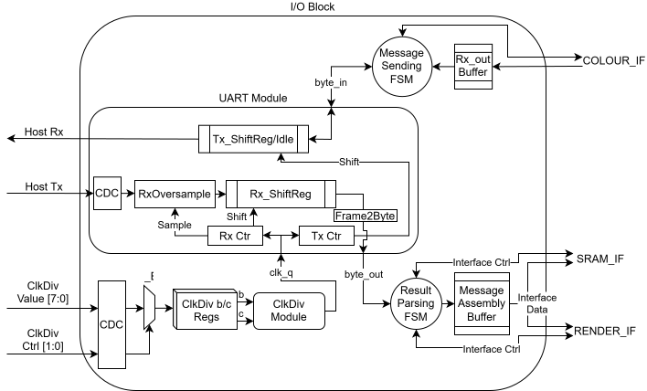

# `io` — Communicates with external device to load scenes and render pixels

## Overview

This module instantiates the UART submodule and translates UART frames to control and data signals for both the SRAM, to initialize scene objects, and the RTU, to start a rendering. This module also decomposes pixel colour data into UART frames to send to the host device.

A key part of this translation is the handling of byte streams as UART frames, described in [UART Frame Encoding](../../encoding/uart_frame.md); inserting and removing control bytes from the stream as needed. Each OBJECT message writes one SRAM word; each RENDER message pulses the RTU's `render` strobe; each pixel from the Accumulator becomes one PIXEL message. The I/O Unit sends one pixel while the RTU renders the next one.

This module also instantiates the Clock Divider that feeds the UART, and has control logic for setting the parameters of the clock divider.

## Parameters

| Name          |   Default    | Description                           |
|---------------|:------------:|---------------------------------------|
| `ADDR_WIDTH`  |     9      | SRAM address width              |
| `DATA_WIDTH`  |     16      | SRAM data width              |
| `COLOUR_DEPTH`  |     8      | Bits per colour channel             |
| `RENDER_START`  |     `8'h00`      | RENDER message start byte |
| `OBJ_START`  |     `8'h01`      | OBJECT message start byte |
| `PIXEL_START`  |     `8'h00`      | PIXEL message start byte |
| `DLE` | `8'h03` | DLE byte |
| `DIM_WIDTH`  |     12      | Width of the image width and height sent to the RTU |

## Ports

### Inputs

| Name          |   Width    | Description                           |
|---------------|:------------:|---------------------------------------|
| `clk`  |     1      | Clock signal |
| `rst_n`  |     1      | Active-low reset |
| `uart_rx`  |     1      | UART serial input from the host device |
| `clkdiv_ctl` | 2 |Clock divider parameter control|
|`clkdiv_data`|8|Clock divider parameter data|

### Outputs

| Name          |   Width    | Description                           |
|---------------|:------------:|---------------------------------------|
| `uart_tx`  |     1      | UART serial output to the host device |

### Interfaces

|Name        | Type          | Description                           |
|------------|---------------|---------------------------------------|
|`pixel`  | [`colour_if.sink`](../tinytracer_if.md#colour_if)  | Pixel colour stream from the Accumulator (`W` = `COLOUR_DEPTH`) |
|`render`| [`render_if.src`](../tinytracer_if.md#render_if)  | Render strobe and image dimensions to the RTU |
|`sram`  | [`sram_wr_if.client`](../tinytracer_if.md#sram_wr_if)  | SRAM write request channel |

## Architecture Overview

### Clock Divider programming
To be fully flexible with the baud rate of our chip, we want to be able to define the clock division ratios of our chip externally.
To do so, we use the following meanings of `clkdiv_ctl`:

| `clkdiv_ctl` | meaning |
|----|----|
| `2'b10` | b <= `clkdiv_data` |
| `2'b11` | c <= `clkdiv_data` |
| otherwise | do nothing |

This does mean that we need a CDC for this data to prevent metastability glitches.

See [`clkdiv`](clkdiv.md) for the values of b and c for common baud rates. `clkdiv_ctl` and `clkdiv_data` have not been assigned pins yet, so the top module ties them to 0.

## UArch Diagram

