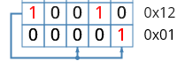

# `rng` — Random number generator

## Overview

This module is a Random Number Generator using a Galois linear feedback shift register (LFSR). It is a submodule of the [Ray Generator](ray_generator.md).

## Parameters

| Name          |   Default    | Description                           |
|---------------|:------------:|---------------------------------------|
| `WLEN`  |     16      | Word length              |
| `SEED` | `16'h0001` | RNG seed |
| `TAPS` | `16'h100B` | XOR tap locations |

## Ports

### Inputs

| Name          |   Width    | Description                           |
|---------------|:------------:|---------------------------------------|
| `clk`  |     1      | Clock signal |
| `rst_n`  |     1      | Active-low reset |
| `req`  |     1      | Shift the LFSR to produce a new random number |

### Outputs

| Name          |   Width    | Description                           |
|---------------|:------------:|---------------------------------------|
| `rand_num`  |     `WLEN`      | Current LFSR state |

## Architecture Overview
Computes a random number using a Galois LFSR

`state <= state[msb] ? state_shifted ^ taps : state_shifted` is the core idea, where a tap is a link back from the MSB to another bit of the LFSR

i.e:

Your taps should be a *Primitive Polynomial* in GF(2), which is used to ensure that the pseudorandom number that is generated is even distributed across the possible values (we are getting the maximum value out of all our LFSR bits).

You can find a list of primitive polynomials in GF(2) here: <https://www.partow.net/programming/polynomials/index.html> (use the polynomial with the fewest terms for the chosen degree)

Keep in mind that the “degree” polynomial value (i.e. x^32 for GF(2^32)) corresponds to our MSB and is not a tap, but what feeds the taps.

The degree should be configurable, though we are probably using a 16-bit LFSR so that’s a good default.

As you will span the entire range of the LFSR, always reset the LFSR value to `'b1`, no need for a fancy seed.

You should only have the LFSR shift when a random number is being requested, to save power in the chip.

`rand_num` is valid in every cycle. A pulse on `req` advances the LFSR at the end of that cycle, so a consumer uses `rand_num` in the same cycle it pulses `req`. Each request advances the LFSR by 16 steps, so that two random numbers in a row share no bits. 16 steps of a Galois LFSR are a fixed XOR network of the state bits, so they can be computed in one cycle. The Ray Generator uses the random bits for the jitter of each primary ray (two numbers per sample), the random vector of a matte bounce (18 bits), and the reflect-or-refract choice of a glass bounce (8 bits); the Ray Generator places them into its macro-op operands by wiring.

This module is always ready, and should shift whenever it is requested, to save power.

## Math:

 A Galois LFSR is a structure that XORs the bit being shifted out with the tap bits.

This is advantageous over the Fibonacci LFSR as it only uses 2-input XOR gates.

Further reading: <https://www.embeddedrelated.com/showarticle/1065.php> (math heavy)