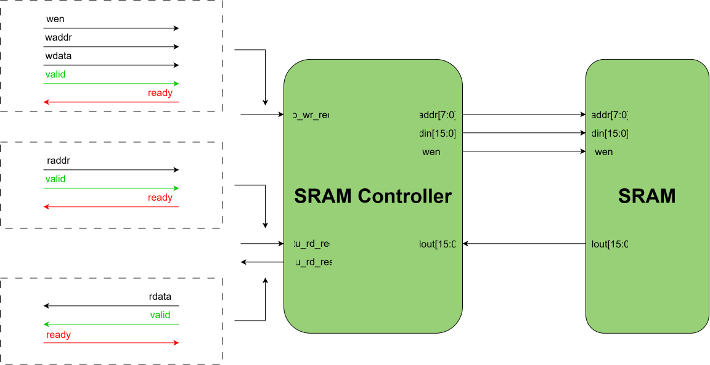

# `sram_control` — SRAM Controller

## Overview

This module selects a request from the I/O Unit or RTU request channel and responds with the appropriate data. 

## Parameters

| Name          |   Default    | Description                           |
|---------------|:------------:|---------------------------------------|
| `ADDR_WIDTH`  |     8      | Width of SRAM addresses               |
| `DATA_WIDTH`  |     16     | Width of SRAM data words              |

## Ports

### Inputs

| Name          |   Width    | Description                           |
|---------------|:------------:|---------------------------------------|
| `clk`  |     1      | Clock signal |
| `rst_n`  |     1      | Active-low reset |
| `dout`  |     `DATA_WIDTH`      | Output data from SRAM |

### Outputs

| Name          |   Width    | Description                           |
|---------------|:------------:|---------------------------------------|
| `wen`  |     1      | SRAM write enable |
| `addr`  |     `ADDR_WIDTH`      | SRAM address for reads/writes |
| `din`  |     `DATA_WIDTH`      | SRAM input data |

### Interfaces

| Type          | Description                           |
|---------------|---------------------------------------|
| `sram_wr_if`  | SRAM write request channel from the I/O Unit |
| `sram_rd_if`  | SRAM read request and response channel from the RTU |

## Architecture Overview

### Truth Table

| `io_wr_req.valid`  |   `rtu_rd_req.valid`  | `sel`  | `req_valid`
|:----:|:-------:|:------:|:------:|
| 0  | 0 | 0 | 0 |
| 0  | 1 | 1 | 1 |
| 1  | 0 | 0 | 1 |
| 1  | 1 | 0 | 0 |

The SRAM controller is only used by the I/O Unit and the RTU. Hence, there is a dedicated write port for the I/O Unit and a dedicated read port for the RTU. The write port contains a request channel, while the read port contains both request and response channels. Both types of channels use standard ready/valid handshake signals.

Since the flow of data on TinyTracer is completely sequential, there is guaranteed to be at most one module making a request to the SRAM controller. Hence, the valid bits of the I/O Unit and RTU request channels can determine which module's request to service. The `sel` signal indicates whether the SRAM will receive data from the I/O Unit or RTU. `sel` = 0 indicates the SRAM is receiving a request from the I/O Unit while `sel` = 1 indicates the SRAM is receiving a request from the RTU. The `req_valid` signal indicates whether the SRAM is receiving a valid request or not. If `req_valid` is 1, then the SRAM controller will use the `sel` signal to multiplex between the I/O Unit and RTU's requests. 

### Timing Behaviour

Once a valid read or write request is presented to the SRAM controller, it is forwarded to the SRAM one clock cycle later. After the request is forwarded to the SRAM, there is another cycle of latency before the SRAM services the request. Hence, read and write operations take 2 cycles to complete.